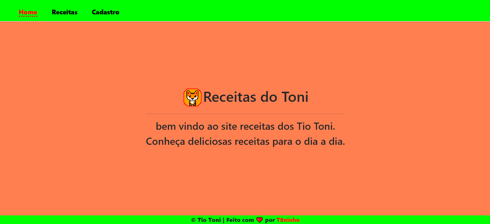
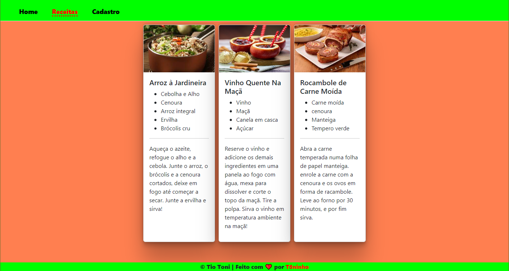
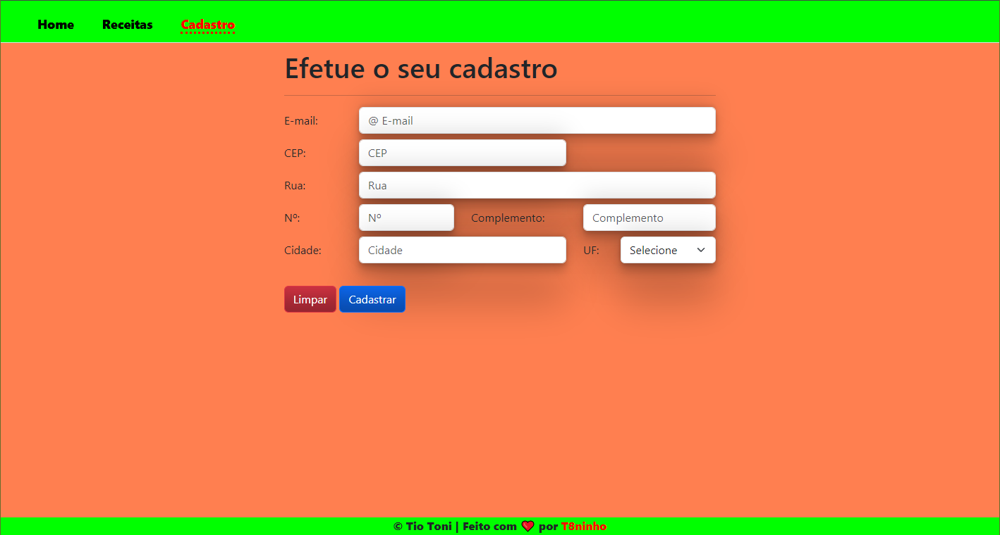

# 

# RPG0008 Meu Primeiro Site Cringe

---

Missão prática do primeiro nível de conhecimento do 2º Mundo do Curso Full-Stack da Universidade Estácio.

🔗 [Projeto](#-Projeto) - [Descrição](#-Descrição) - [Objetivo](#-Objetivo) - [Materiais_necessários](#-Materiais_necessários) - [Instalação](#-Instalação) - [Imagens](#-Imagens) - [Autor](#-Autor).

---

## 📋 Projeto

Implementação de um site voltado para o fornecimento de `Receitas Culinárias` com a utilização apenas de `HTML` e `CSS`, utilizando os elementos do Framework Bootstrap, uma `Missão Prática` do curso de `Desenvolvimento Full-Stack` da `Universidade Estacio de Sá` do `2º Mundo` do semestre de `2024.1`.

---

## 📝 Descrição

Para facilitar a implementação deste projeto precisamos:

- Criar um objetivo especifico.
- Materiais necessários para a prática.
- Metodologia de Desenvolvimento da Prática.

---

## 💼 Objetivo

O nosso propósito é desenvolver e manter a capacidade de criar e implementar um site que seja `responsivo`.
Considerando os objetivos listados:

1. Definir a estrutura do site na `Sintaxe HTML`.
2. Utilizar folhas de estilo `CSS` na formatação das páginas.
3. Definir uma fonte de dados estática, no próprio `HTML`.
4. Utilizar elementos básicos de formatação com o `FrameworkElement` `Bootstrap`.

---

## 🛠 Materiais_necessários

Para atingirmos o nosso objetivo, recomendamos os seguintes tópicos:

|Tecnologias| Atributos|
|----------------|-----------------|
| Computador | Com acesso à Internet|
| Visual Studio Code | Editor de Código |
| HTML CSS | Linguagens|
| Navegador de Internet | Chrome ou Firefox|
| Bootstrap | Framework Front-End |

Segue os links para baixar as tecnologias que foram utilizadas:

  &nbsp;

## 📉 Instalação

Acesse o link do repositório → [Receitas-do-Toni-WebSite](https://github.com/T8ninho/Receitas-do-Toni-WebSite)
acesse a guia do `Arquivo` clique em `code` escolha a opção desejada para `clonar o repositorio`.
`Open with Github Desktop Open with Visual Studio` ou `Download ZIP`

 Observação:  A melhor opção é a copiar do link HTTPS para fazer a instalação ou clonar um arquivo no github.

 ---

## 🔎 Imagens

Página Inicial

A estrutura deste site foi definida de forma básica com `HTML5` a linguagem para `pt-br`os elementos `semânticos`com uma imagem de `logotipo próprio` e a área de `rodapé` incluido a informação de `copyright` etc.

Página de Receitas

As receitas foram apresentas em `div`, organizadas no modo `flex` utilizando a barra de rolagem `vertical responsiva`.

Página do cadastro

As demais páginas foram modificadas para acrescentar o codigo do menu incluindo o `bootstrap`.

## 👩‍💻 Autor

Este repositório foi desenvolvido por
|Autor|Matricúla|
|----------------|----------------|
| Antonio Vitor |202307014834||

Para mais informação entre em contato com a administração da `Estacio` ou aqui `comigo`.
